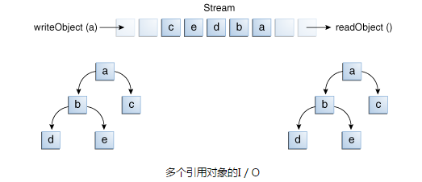

# 对象流
就像数据流支持原始数据类型的I / O,对象流支持I / O的对象。大部分,但不是全部,标准类支持对象的序列化。都实现了标记接口`Serializable`

对象流类是
* ObjectInputStream
* ObjectOutputStream。

这些类实现 ObjectInput和 ObjectOutput，它们是DataInput和DataOutput的子类。这意味着**数据流**中涵盖的所有原始数据I/O方法也在对象流中实现。因此，对象流可以包含原始值和对象值的混合。
```java
public class ObjectStreams {
    static final String dataFile = "invoicedata";

    static final BigDecimal[] prices = {
        // 使用对象类型来表示价格
        new BigDecimal("19.99"),
        new BigDecimal("9.99"),
        new BigDecimal("15.99"),
        new BigDecimal("3.99"),
        new BigDecimal("4.99") };
    static final int[] units = { 12, 8, 13, 29, 50 };
    static final String[] descs = { "Java T-shirt",
            "Java Mug",
            "Duke Juggling Dolls",
            "Java Pin",
            "Java Key Chain" };

    public static void main(String[] args)
        throws IOException, ClassNotFoundException {


        ObjectOutputStream out = null;
        try {
            out = new ObjectOutputStream(new
                    BufferedOutputStream(new FileOutputStream(dataFile)));
            // 并写一个 日历类型
            out.writeObject(Calendar.getInstance());
            for (int i = 0; i < prices.length; i ++) {
                out.writeObject(prices[i]);
                out.writeInt(units[i]);
                out.writeUTF(descs[i]);
            }
        } finally {
            out.close();
        }

        ObjectInputStream in = null;
        try {
            in = new ObjectInputStream(new
                    BufferedInputStream(new FileInputStream(dataFile)));

            Calendar date = null;
            BigDecimal price;
            int unit;
            String desc;
            BigDecimal total = new BigDecimal(0);

            date = (Calendar) in.readObject();

            System.out.format ("On %tA, %<tB %<te, %<tY:%n", date);

            try {
                while (true) {
                    price = (BigDecimal) in.readObject();
                    unit = in.readInt();
                    desc = in.readUTF();
                    System.out.format("You ordered %d units of %s at $%.2f%n",
                            unit, desc, price);
                    total = total.add(price.multiply(new BigDecimal(unit)));
                }
            } catch (EOFException e) {}
            System.out.format("For a TOTAL of: $%.2f%n", total);
        } finally {
            in.close();
        }
    }
}
```

## 复杂对象的输出和输入
writeObject与readObject方法使用简单，但它们包含一些非常复杂的对象管理逻辑。对于像日历这样的封装原始值的类来说，这并不重要。但是许多对象包含对其他对象的引用。如果readObject要从流中重构对象，则必须能够重构所引用的原始对象的所有对象。这些附加对象可能有自己的引用，依此类推。在这种情况下，writeObject遍历对象中所有的引用，并将这些引用写入流。因此，单个调用writeObject可能导致大量对象被写入流。

如下图所示：


您可能会想，如果同一流中的两个对象都包含对单个对象的引用，会发生什么。他们回读时是否会指向单个对象？

答案是“是”。

因此，如果您将一个对象显式写入一个流两次，那么您真的只写两次引用。例如，如果以下代码将一个对象ob两次写入流中：
```java
Object ob = new Object();
out.writeObject(ob);
out.writeObject(ob);

Object ob1 = in.readObject();
Object ob2 = in.readObject();
```
那么读取出来的引用地址是一样的。

然而，如果单个对象被写入两个不同的流，则它被有效地重复 - 读取两个流的单个程序将看到两个不同的对象。
