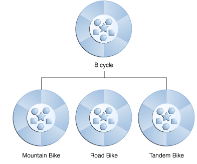

# 什么是继承

不同种类的物体通常具有一定的共同之处。例如，山地自行车，公路自行车和串联自行车都具有自行车的特点（当前速度、当前踏板节奏、当前档位）。然而每个都定义了他们不同的附加特征：串联自行车具有两个座椅和两组车把；公路自行车有落地车把；一些山地自行车有一个额外的链环。

面向对象的编程允许类从其他类**继承**常用的状态和行为。在这个例子中，Bicycle 现在就变成了父，其 `Mountain Bike`、`Road Bike`、`Randem Bike` 都继承了 Bicycle 。在 Java 编程语言中，每个类都被允许有一个直接的超类，每个超类都可以具有无限数量的子类；



创建子类的语法很简单。在类声明的开头，使用`extends`关键字
```java
class MountainBike extends Bicycle {

    // new fields and methods defining
    // a mountain bike would go here

}
```
这里使 MountainBike 具有 Bicycle 的相同的字段和方法。但允许其代码专注于使其拥有独特的功能。这使您的子类的代码容器阅读。但是，您必须注意正确记录每个超类定义的状态和行为，因为该代码不会出现在每个子类的源文件中。


---

> [官网原文](https://docs.oracle.com/javase/tutorial/java/concepts/inheritance.html)
