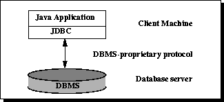

# JDBC 简介

JDBC API 是一种 Java API，它可以访问任何类型的表格数据，特别是存储在关系数据库中的数据。

JDBC 帮助您编写管理这三种编程活动的 Java 应用程序：

1. 连接到数据源，例如数据库
2. 将 **查询** 和 **更新** 语句发送到数据库
3. 检索和处理从数据库接收到的响应您的查询的结果

下面的简单代码片段给出了这三个步骤的简单示例：

```java
import java.sql.Connection;
import java.sql.DriverManager;
import java.sql.ResultSet;
import java.sql.SQLException;
import java.sql.Statement;

public class JdbcTest {
    public void connectToAndQueryDatabase(String username, String password) throws SQLException {
		// 链接到数据源
        Connection con = DriverManager.getConnection(
                "jdbc:myDriver:myDatabase",
                username,
                password);

        Statement stmt = con.createStatement();
        // 发送语句
        ResultSet rs = stmt.executeQuery("SELECT a, b, c FROM Table1");

        // 处理响应结果
        while (rs.next()) {
            int x = rs.getInt("a");
            String s = rs.getString("b");
            float f = rs.getFloat("c");
        }
    }
}
```

这个代码片段实例化一个 DriverManager 对象连接到数据库驱动程序并登录到数据库，实例化一个语句对象，它携带你的 SQL 语言查询到数据库；实例化检索查询结果的 ResultSet 对象，并执行一个简单的 while 循环，该循环检索并显示这些结果。就是这么简单。

## JDBC 产品组件

JDBC 包含四个组件：

1. **JDBC API**

   JDBC API 提供了从 Java 编程语言对关系数据的编程访问。使用 JDBC API，应用程序可以执行 SQL 语句、检索结果并将更改传播回底层数据源。JDBC API 还可以与分布式、异构环境中的多个数据源交互。

   JDBC API 是 Java 平台的一部分，Java 平台包括 Java 标准版(Java SE)和 Java 企业版(Java EE)。JDBC 4.0 API被分为两个包：`java.sql` 和 `javax.sql`，这两个包都包含在 Java SE 和 Java EE 平台中。

2. **JDBC 驱动程序管理器**

   JDBC `DriverManager` 类定义了可以将 Java 应用程序连接到 JDBC 驱动程序的对象。驱动程序管理器一直是JDBC 体系结构的传统支柱。它很小，也很简单。

   标准扩展包  `javax.naming` 和 `javax.sql`，允许您使用注册于 Java 命名和目录接口(JNDI)命名服务的数据源对象来建立与数据源的连接。您可以使用任何一种连接机制，但是建议尽可能使用 `DataSource` 对象。

3. **JDBC 测试套件** 

   JDBC 驱动程序测试套件可帮助您确定 JDBC 驱动程序将运行您的程序。这些测试不是全面的或详尽的，但是它们确实行使用了 JDBC API 中的许多重要功能。

4. **JDBC-ODBC 桥**

   Java 软件桥通过 ODBC 驱动程序提供 JDBC 访问。请注意，需要将 ODBC 二进制代码加载到使用此驱动程序的每台客户机上。因此，ODBC 驱动程序最适合于在客户端安装不是主要问题的公司网络上使用，或者适用于用 Java 在三层体系结构中编写的应用程序服务器代码。

本课程使用这四个 JDBC 组件中的前两个连接到数据库，然后构建一个 java 程序，该程序使用 SQL 命令与测试关系数据库通信。最后两个组件在专门的环境中用于测试 web 应用程序，或与支持 odbc 的 dbms 通信。

## JDBC 架构

两层和三层处理模型

JDBC API 支持用于数据库访问的两层和三层处理模型。

###  数据访问的两层体系结构



在两层模型中，Java applet 或 **应用程序直接与数据源对话**。这要求 JDBC 驱动程序能够与被访问的特定数据源通信。用户的命令被传递到数据库或其他数据源，这些语句的结果被发送回用户。数据源可以位于用户通过网络连接到的另一台机器上。这被称为 **客户机/服务器配置**，用户的机器作为 **客户机**，存放数据源的机器作为 **服务器**。网络可以是内部网，例如，它连接公司内部的员工，也可以是 Internet。

### 数据访问的三层体系结构

在三层模型中，**命令被发送到服务的** “**中间层**”，然后该中间层将命令发送到数据源。数据源处理命令并将结果发送回中间层，中间层随后将结果发送给用户。MIS 主管发现三层模型非常有吸引力，因为 **中间层使控制访问和可以对企业数据进行的更新** 成为可能。另一个优点是它简化了应用程序的部署。最后，在许多情况下，三层体系结构 **可以提供性能优势**。


直到最近，中间层还常常是用 C 或 c++ 之类的语言编写的，这些语言提供了快速的性能。然而，由于引入了将 Java 字节码转换为有效的特定于机器的代码和技术(如 Enterprise JavaBeans) 的优化编译器，Java 平台正迅速成为中间层开发的标准平台。这是一个很大的优点，可以利用 Java 的健壮性、多线程和安全特性。

随着越来越多的企业使用 Java 编程语言编写服务器代码，JDBC API 越来越多地被用于三层体系结构的中间层。
**使 JDBC 成为服务器技术** 的一些特性是它对 **连接池**、**分布式事务**和 **断开连接** 的行集的支持。JDBC API 还允许从Java 中间层访问数据源。

## 关系数据库概述

数据库是一种存储信息的方式，可以从中 **检索信息**。用最简单的术语来说，关系数据库就是用带有 **行和列的表** 表示信息的数据库。**表被称为关系**，因为它是 **相同类型(行)的对象的集合**。表中的数据可以根据 **公共键** 或 **概念** 进行关联，**从表中检索相关数据的能力** 是关系数据库这个术语的基础。数据库管理系统(DBMS)处理 **数据存储**、**维护** 和 **检索** 的方式。对于关系数据库，关系数据库管理系统(RDBMS)执行这些任务。在这本书中使用的 DBMS 是一个通用术语，包括 RDBMS。

### 规则

关系表遵循某些 **完整性规则**，以 **确保其中包含的数据保持准确并始终可访问**。

首先，**关系表中的行应该是完全不同的**。如果有重复的行，那么在解决两个可能的选择中哪一个是正确的选择时就会出现问题。对于大多数 DBMS，用户可以指定不允许重复的行，如果这样做了，DBMS 将阻止添加任何重复现有行的行。

传统关系模型的第二个完整性规则是 **列值不能重复组或数组**。

数据完整性的第三个方面涉及到 **空值** 的概念。数据库通过使用空值来表示缺少某个值来处理数据不可用的情况。
它不等于 **空白** 或 **零**。一个空白被认为等于另一个空白，一个零被认为等于另一个零，**但是两个空值不被认为是相等的**。

当表中的每一行不同时，可以使用 **一列或多列来标识特定的行**。这个 **唯一的列或列组称为主键**。属于主键的任何列都不能为空；如果是，包含它的主键将不再是一个完整的标识符。此规则称为 **实体完整性**。

Employees 表演示了其中一些关系数据库概念。它有 5 列和 6 行，每一行表示一个不同的雇员。

`Employees` Table

| `Employee_Number` | `First_name` | `Last_Name` | `Date_of_Birth` | `Car_Number` |
| ----------------- | ------------ | ----------- | --------------- | ------------ |
| 10001             | Axel         | Washington  | 28-Aug-43       | 5            |
| 10083             | Arvid        | Sharma      | 24-Nov-54       | null         |
| 10120             | Jonas        | Ginsberg    | 01-Jan-69       | null         |
| 10005             | Florence     | Wojokowski  | 04-Jul-71       | 12           |
| 10099             | Sean         | Washington  | 21-Sep-66       | null         |
| 10035             | Elizabeth    | Yamaguchi   | 24-Dec-59       | null         |

这个表的 **主键通常是员工编号**，因为每个员工编号都保证是不同的。（在进行比较时，**数字也比字符串更有效**。）
也可以使用 First_Name 和 Last_Name，因为这两者的组合也只能标识数据库中的一行。只使用姓是不行的，因为有两个员工的姓是 “Washington”。在这种特殊情况下，名称都是不同的，因此可以使用该列作为主键，但最好避免使用可能出现重复的列。如果 Elizabeth Yamaguchi 在这家公司得到一份工作，并且主键是 First_Name，RDBMS 将不允许添加她的名字（如果已经指定不允许重复）。由于表中已经有一个 Elizabeth，添加第二个 Elizabeth 将使主键作为标识一行的方式变得无用。注意，尽管在本例中使用 First_Name 和 Last_Name 是唯一的组合键，但在较大的数据库中可能不是唯一的。还要注意，Employee 表假设每个员工只能有一辆车。

### SELECT 语句

SQL 是一种设计用于关系数据库的语言。有一组基本的 SQL 命令被认为是标准的，并被所有 rdbms 使用。例如，所有 rdbms 都使用 SELECT 语句。

SELECT 语句，也称为查询，用于从表中获取信息。它指定一个或多个列标题、一个或多个要从中选择的表以及一些选择标准。RDBMS 返回满足指定要求的列条目的行。如下所示的 SELECT 语句将获取拥有公司车辆的员工的姓和名：

```sql
SELECT First_Name, Last_Name
FROM Employees
WHERE Car_Number IS NOT NULL
```

接下来是结果集（满足 Car_Number 列中不为 null 要求的行集）。对于满足要求的每一行，都会打印名和姓，因为SELECT 语句 （第一行）指定了列 First_Name 和 Last_Name。FROM 子句 （第二行）给出将从中选择列的表。

| FIRST_NAME | LAST_NAME  |
| ---------- | ---------- |
| Axel       | Washington |
| Florence   | Wojokowski |

下面的代码将生成一个包含整个表的结果集，因为它要求得到 employee 表中所有没有限制 （没有 WHERE 子句）的列。注意，`SELECT *` 表示选择所有列。

```sql
SELECT *
FROM Employees
```

### WHERE 子句

SELECT 语句中的 WHERE 子句提供了选择值的条件。例如，在下面的代码片段中，只有在列 Last_Name 以字符串 「Washington」 开头的行中才会选择值。

```sql
SELECT First_Name, Last_Name
FROM Employees
WHERE Last_Name LIKE 'Washington%'
```

LIKE 关键字用于比较字符串，它提供了可以使用包含通配符的模式的特性。例如，在上面的代码片段中，在「Washington」 的末尾有一个百分号（%），它表示任何包含字符串「Washington」 的值加上 0 个或更多附加字符都将满足这个选择条件。所以「Washington」 或 「Washingtonian」是匹配的，而 「Washing」不是。LIKE 子句中使用的另一个通配符是下划线（`_`），它代表任何一个字符。例如：

```sql
WHERE Last_Name LIKE 'Ba_man'
```

会匹配 「Batman」，「Barman」，「Badman」，「Balman」，「Bagman」，「Bamman」，等等。

下面的代码片段有一个 WHERE 子句，它使用等号（=）来比较数字。它选择被分配汽车 12 的员工的姓和名。

```sql
SELECT First_Name, Last_Name
FROM Employees
WHERE Car_Number = 12
```

下一个代码片段选择员工编号大于 10005 的员工的姓和名：

```sql
SELECT First_Name, Last_Name
FROM Employees
WHERE Employee_Number > 10005
```

WHERE 子句可能会非常复杂，包含多个条件，在某些 dbms 中还包含嵌套条件。这个概述不会涉及复杂的 WHERE子句，但是下面的代码片段有一个包含两个条件的 WHERE 子句;此查询选择员工编号小于 10100 且没有公司汽车的员工的姓和名。

```sql
SELECT First_Name, Last_Name
FROM Employees
WHERE Employee_Number < 10100 and Car_Number IS NULL
```

一种特殊类型的 WHERE 子句涉及到连接，下一节将对此进行解释。

### join

关系数据库的一个显著特性是，可以从多个表中获取数据，这就是所谓的联接。假设在检索了拥有公司汽车的员工的姓名之后，想要找出谁拥有哪辆汽车，包括汽车的制造商、型号和年份。这个信息存储在另一个表 Cars 中：

`Cars` Table

| `Car_Number` | `Make` | `Model`  | `Year` |
| ------------ | ------ | -------- | ------ |
| 5            | Honda  | Civic DX | 1996   |
| 12           | Toyota | Corolla  | 1999   |

两个表中必须有一个列，这样才能相互关联。这个列必须是一个表中的 **主键**，**在另一个表中称为外键**。在本例中，出现在两个表中的列是 Car_Number，它是表 Cars 的主键和表 Employees 的外键。如果 1996 年的本田思域被破坏并从 Cars 表中删除，那么 Car_Number 5 也必须从 Employees 表中删除，以保持 **所谓的引用完整性**。否则，Employees 表中的外键列 （Car_Number）将包含一个没有引用 Cars 中的任何内容的条目。外键必须为空或等于其引用的表的现有主键值。这与主键不同，主键可能不是 null。在 Employees 表的 Car_Number 列中有几个空值，因为员工可能没有公司的汽车。

下面的代码询问拥有公司汽车的员工的姓和名，以及这些汽车的制造、型号和年份。注意，FROM 子句同时列出了雇员和汽车，因为请求的数据都包含在两个表中。在列名前使用表名和点（`.`）表示哪个表包含该列。

```sql
SELECT Employees.First_Name, Employees.Last_Name,
    Cars.Make, Cars.Model, Cars.Year
FROM Employees, Cars
WHERE Employees.Car_Number = Cars.Car_Number
```

这将返回一个类似于下面的结果集：

| `FIRST_NAME` | `LAST_NAME` | `MAKE` | `MODEL`  | `YEAR` |
| ------------ | ----------- | ------ | -------- | ------ |
| Axel         | Washington  | Honda  | Civic DX | 1996   |
| Florence     | Wojokowski  | Toyota | Corolla  | 1999   |

### 常见的 SQL 命令

SQL 命令分为两类，主要是 **数据操作语言（DML）**命令和 **数据定义语言（DDL）**命令。

- DML 命令处理数据，检索或修改数据以使其保持最新。
- DDL 命令创建或更改表和其他数据库对象，如视图和索引。

更常见的 DML 命令列表如下：

- SELECT 

  用于查询和显示数据库中的数据。SELECT 语句指定在结果集中包含哪些列。应用程序中使用的绝大多数 SQL 命令都是 SELECT 语句。

- INSERT 

  向表中添加新行。INSERT 用于填充新创建的表，或向已经存在的表中添加新行。

- DELETE 

  从表中移除指定的行或行集

- UPDATE 

  更改表中一列或一组列中的现有值

更常见的 DDL 命令如下：

- CREATE TABLE

  使用用户提供的列名创建表。

  用户还需要为每列中的数据指定类型。数据类型因 RDBMS 的不同而不同，因此用户可能需要使用元数据来建立特定数据库所使用的数据类型。CREATE TABLE 的使用频率通常低于数据操作命令，因为表只创建一次，而添加或删除行或更改单个值通常更频繁。

- DROP TABLE

  从数据库中删除所有行并删除表定义。

  需要一个 JDBC API 实现来支持 SQL92 过渡级别指定的 DROP TABLE 命令。但是，对 DROP 表的级联和限制选项的支持是可选的。此外，当定义了引用被删除表的视图或完整性约束时，DROP TABLE 的行为是由实现定义的。

- ALTER TABLE

  从表中添加或删除列。它还添加或删除表约束并修改列属性

### 结果集和游标

满足查询条件的行称为结果集。结果集中返回的行数可以是 0、1 或多个。用户可以 **一次一行** 地访问结果集中的数据，游标提供了这样做的方法。可以将游标看作是 **指向包含结果集行的文件的指针**，并且该指针能够跟踪当前正在访问的行。游标允许用户从上到下处理结果集的每一行，因此可以用于迭代处理。大多数 dbms 在生成结果集时自动创建游标。

早期的 JDBC API 版本为结果集的游标添加了新功能，允许它向前和向后移动，还允许它移动到指定的行或相对于另一行位置的行。

### 事物

当一个用户访问数据库中的数据时，另一个用户可能 **同时访问相同的数据**。例如，如果第一个用户更新表中的某些列，同时第二个用户从同一表中选择列，那么第二个用户可能获得 **部分旧数据和部分更新的数据**。因此，dbms 使用事务来维护处于一致状态的数据（**数据一致性**），同时允许多个用户同时访问数据库（**数据并发性**）。

事务是组成逻辑工作单元的一条或多条 SQL 语句的集合。事务以提交或回滚结束，这取决于数据一致性或数据并发性是否存在任何问题。commit 语句使事务中的 SQL 语句引起的永久更改，rollback 语句撤销事务中的 SQL 语句引起的所有更改。

**锁** 是一种 **阻止两个事务同时操作相同数据的机制**。例如，如果表上有未提交的事务，表锁可以防止删除该表。在一些 dbms 中，表锁还锁住表中的所有行。**行锁阻止两个事务修改同一行**，或者阻止一个事务在另一个事务仍在修改该行时选择该行。

### 存储过程

存储过程是一组可以按名称调用的 SQL 语句。换句话说，它是可执行的代码，一个迷你程序，执行一个特定的任务，可以像调用函数或方法一样调用这个任务。传统上，存储过程是用特定于 dbms 的编程语言编写的。最新一代的数据库产品允许使用 Java 编程语言和 JDBC API 编写存储过程。用 Java 编程语言编写的存储过程是在 dbms 之间可移植的字节码。一旦编写了存储过程，就可以使用和重用它，因为支持存储过程的 DBMS 将如其名称所暗示的那样，将其存储在数据库中。

下面的代码示例演示了如何使用 Java 编程语言创建一个非常简单的存储过程。请注意，存储过程只是一个包含普通 JDBC 代码的静态 Java 方法。它接受两个输入参数并使用它们更改员工的车号。

如果此时您还不理解示例，请不必担心。下面的代码示例只是为了说明存储过程是什么样的。在接下来的教程中，您将学习如何编写本示例中的代码。

```java
import java.sql.*;

public class UpdateCar {

    public static void UpdateCarNum(int carNo, int empNo)
        throws SQLException {

        Connection con = null;
        PreparedStatement pstmt = null;   
      
        try {
            con = DriverManager.getConnection(
                      "jdbc:default:connection");

            pstmt = con.prepareStatement(
                        "UPDATE EMPLOYEES " +
                        "SET CAR_NUMBER = ? " +
                        "WHERE EMPLOYEE_NUMBER = ?");

            pstmt.setInt(1, carNo);
            pstmt.setInt(2, empNo);
            pstmt.executeUpdate();
        }
        finally {
            if (pstmt != null) pstmt.close();
        }
    }
}
```

### 源数据

数据库存储用户数据，还存储关于数据库本身的信息。

大多数 dbms 都有一组系统表，这些表列出数据库中的表、每个表中的列名、主键、外键、存储过程等等。每个DBMS 都有自己的功能来获取关于 **表布局 **和 **数据库特性** 的信息。JDBC 提供 **DatabaseMetaData** 接口，驱动程序编写器必须实现这个接口，以便它的方法返回关于驱动程序和/或为其编写驱动程序的 DBMS 的信息。例如，很多方法返回驱动程序是否支持特定的功能。该接口为用户和工具提供了获取元数据的标准化方法。

一般来说，编写工具和驱动程序的开发人员最可能关心元数据。

